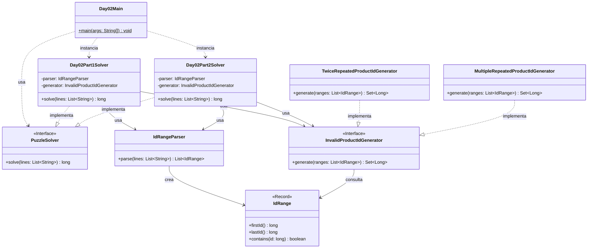

# Advent of Code 2025 - Day 2: Gift Shop

Este proyecto contiene la solución para el **Día 2** del Advent of Code 2025: **Gift Shop**.

El problema consiste en detectar identificadores de producto inválidos dentro de una serie de rangos numéricos. Estos identificadores inválidos siguen patrones repetitivos de dígitos.

El día está dividido en dos partes:

* **Parte 1**: un ID es inválido si está formado por una secuencia de dígitos repetida exactamente dos veces.
* **Parte 2**: un ID es inválido si está formado por una secuencia de dígitos repetida al menos dos veces.

---

## Descripción del problema

La entrada del problema contiene una lista de rangos de IDs separados por comas.

Ejemplo:

```text
11-22,95-115,998-1012,1188511880-1188511890
```

Cada rango tiene este formato:

```text
inicio-fin
```

Por ejemplo:

```text
95-115
```

representa todos los IDs desde `95` hasta `115`, ambos incluidos.

---

## Parte 1

En la primera parte, un ID es inválido si está formado por una secuencia de dígitos repetida exactamente dos veces.

Ejemplos de IDs inválidos:

```text
55
6464
123123
```

En estos casos:

* `55` es `5` repetido dos veces;
* `6464` es `64` repetido dos veces;
* `123123` es `123` repetido dos veces.

Ejemplos de IDs válidos:

```text
101
1234
111
```

En la parte 1, `111` no se considera inválido porque no está formado por una secuencia repetida exactamente dos veces con la misma longitud total.

La respuesta conocida para el input real de la parte 1 es:

```text
9188031749
```

---

## Parte 2

En la segunda parte, la regla se amplía.

Ahora un ID es inválido si está formado por una secuencia de dígitos repetida al menos dos veces.

Ejemplos de IDs inválidos:

```text
12341234
123123123
1212121212
1111111
```

En estos casos:

* `12341234` es `1234` repetido dos veces;
* `123123123` es `123` repetido tres veces;
* `1212121212` es `12` repetido cinco veces;
* `1111111` es `1` repetido siete veces.

La diferencia principal respecto a la parte 1 es que ahora no se exige que la repetición sea exactamente dos veces, sino dos o más veces.

---

## Diseño y arquitectura

La solución sigue la misma estructura establecida para los días anteriores del proyecto:

```text
day02
├── Day02Main.java
├── common
├── part1
└── part2
```

El objetivo es separar claramente:

* el punto de entrada del día;
* las clases comunes del dominio;
* la solución específica de la parte 1;
* la solución específica de la parte 2.

La lógica común del problema se encuentra en el paquete `common`, mientras que cada parte tiene su propio solver y su propia estrategia de generación de IDs inválidos.

---

## Principios aplicados

### Single Responsibility Principle, SRP

Cada clase tiene una única responsabilidad:

* `Day02Main`: ejecuta el día 2 y muestra los resultados.
* `Day02Part1Solver`: resuelve únicamente la parte 1.
* `Day02Part2Solver`: resuelve únicamente la parte 2.
* `IdRange`: representa un rango de IDs.
* `IdRangeParser`: convierte el input textual en rangos.
* `InvalidProductIdGenerator`: define el contrato para generar IDs inválidos.
* `TwiceRepeatedProductIdGenerator`: genera IDs inválidos para la parte 1.
* `MultipleRepeatedProductIdGenerator`: genera IDs inválidos para la parte 2.

Esta separación permite modificar o probar cada pieza de forma independiente.

---

### Open/Closed Principle, OCP

El diseño permite extender el comportamiento sin modificar el código existente.

Por ejemplo, si apareciera una nueva regla para una hipotética parte 3, se podría crear una nueva implementación de `InvalidProductIdGenerator` sin modificar los solvers existentes.

Ejemplo:

```text
part3
└── AnotherInvalidProductIdGenerator.java
```

De esta manera, el sistema queda abierto a extensión, pero cerrado a modificaciones innecesarias.

---

### Dependency Inversion Principle, DIP

Los solvers no dependen directamente de una implementación concreta en su lógica principal, sino de la abstracción:

```java
InvalidProductIdGenerator
```

Esto permite que la generación de IDs inválidos pueda cambiar sin alterar la estructura general del solver.

Además, los solvers implementan la interfaz común:

```java
PuzzleSolver
```

lo que permite ejecutar distintas partes del problema de forma uniforme.

---

### DRY

La lógica común se reutiliza en el paquete:

```text
es.ulpgc.aoc2025.day02.common
```

Aquí se encuentran las clases compartidas por ambas partes:

* `IdRange`
* `IdRangeParser`
* `InvalidProductIdGenerator`

Así se evita duplicar el parsing de rangos o la representación del dominio en cada parte.

---

### Código expresivo

El código intenta representar directamente los conceptos del problema.

Por ejemplo:

* `IdRange` representa un rango de IDs.
* `InvalidProductIdGenerator` expresa la idea de generar IDs inválidos.
* `TwiceRepeatedProductIdGenerator` indica claramente la regla de la parte 1.
* `MultipleRepeatedProductIdGenerator` indica claramente la regla de la parte 2.

Esto hace que el código sea más fácil de leer y mantener.

---

## Estructura del proyecto

```text
src
├── main
│   ├── java
│   │   └── es
│   │       └── ulpgc
│   │           └── aoc2025
│   │               ├── common
│   │               │   └── PuzzleSolver.java
│   │               │
│   │               └── day02
│   │                   ├── Day02Main.java
│   │                   │
│   │                   ├── common
│   │                   │   ├── IdRange.java
│   │                   │   ├── IdRangeParser.java
│   │                   │   └── InvalidProductIdGenerator.java
│   │                   │
│   │                   ├── part1
│   │                   │   ├── Day02Part1Solver.java
│   │                   │   └── TwiceRepeatedProductIdGenerator.java
│   │                   │
│   │                   └── part2
│   │                       ├── Day02Part2Solver.java
│   │                       └── MultipleRepeatedProductIdGenerator.java
│   │
│   └── resources
│       └── day02
│           └── input.txt
│
└── test
    └── java
        └── es
            └── ulpgc
                └── aoc2025
                    └── day02
                        ├── part1
                        │   └── Day02Part1SolverTest.java
                        └── part2
                            └── Day02Part2SolverTest.java
```

---

## Paquetes principales

### `es.ulpgc.aoc2025.common`

Contiene código común a todo el proyecto Advent of Code.

Actualmente contiene:

```text
PuzzleSolver.java
```

Esta interfaz define el contrato general que deben cumplir todos los solvers:

```java
long solve(List<String> lines);
```

---

### `es.ulpgc.aoc2025.day02`

Contiene el punto de entrada específico del día 2:

```text
Day02Main.java
```

Esta clase se encarga de:

1. leer el archivo de entrada;
2. crear el solver de la parte 1;
3. crear el solver de la parte 2;
4. ejecutar ambos solvers;
5. mostrar los resultados por consola.

---

### `es.ulpgc.aoc2025.day02.common`

Contiene las clases comunes del dominio del día 2.

Estas clases son compartidas por la parte 1 y la parte 2.

---

## Clases principales

### `IdRange`

Representa un rango de IDs.

Se puede implementar como `record`, ya que es un objeto de datos inmutable compuesto por dos valores:

```java
package es.ulpgc.aoc2025.day02.common;

public record IdRange(long firstId, long lastId) {

    public IdRange {
        if (firstId < 0) {
            throw new IllegalArgumentException("First id cannot be negative");
        }

        if (lastId < 0) {
            throw new IllegalArgumentException("Last id cannot be negative");
        }

        if (firstId > lastId) {
            throw new IllegalArgumentException("First id cannot be greater than last id");
        }
    }

    public boolean contains(long id) {
        return firstId <= id && id <= lastId;
    }
}
```

El uso de `record` aporta varias ventajas:

* expresa que el rango es un dato inmutable;
* genera automáticamente `firstId()` y `lastId()`;
* genera automáticamente `equals()`, `hashCode()` y `toString()`;
* reduce código repetitivo;
* permite añadir validación en el constructor compacto.

---

### `IdRangeParser`

Convierte el input textual en una lista de rangos.

Por ejemplo:

```text
11-22,95-115,998-1012
```

se transforma en una lista de objetos `IdRange`.

Su responsabilidad es únicamente interpretar el formato de entrada.

---

### `InvalidProductIdGenerator`

Define el contrato común para las clases que generan IDs inválidos.

```java
Set<Long> generate(List<IdRange> ranges);
```

Gracias a esta interfaz, cada parte puede tener su propia estrategia de generación sin cambiar la estructura general del solver.

---

### `TwiceRepeatedProductIdGenerator`

Genera los IDs inválidos de la parte 1.

Un ID generado por esta clase está formado por una secuencia repetida exactamente dos veces.

Ejemplos:

```text
11
6464
123123
```

La clase no recorre todos los IDs de todos los rangos. En su lugar:

1. calcula el mayor ID de los rangos;
2. genera posibles patrones repetidos;
3. comprueba si cada candidato cae dentro de algún rango;
4. guarda los IDs inválidos en un `Set`.

---

### `MultipleRepeatedProductIdGenerator`

Genera los IDs inválidos de la parte 2.

Un ID generado por esta clase está formado por una secuencia repetida dos o más veces.

Ejemplos:

```text
111
123123123
1212121212
```

Se utiliza un `Set<Long>` porque un mismo número puede detectarse mediante más de una repetición.

Por ejemplo:

```text
1111
```

puede interpretarse como:

```text
1 repetido 4 veces
11 repetido 2 veces
```

pero debe sumarse una sola vez.

---

### `Day02Part1Solver`

Resuelve la primera parte del problema.

Su algoritmo es:

1. parsear el input para obtener los rangos;
2. generar los IDs inválidos según la regla de repetición exacta dos veces;
3. sumar los IDs encontrados.

---

### `Day02Part2Solver`

Resuelve la segunda parte del problema.

Su algoritmo es:

1. parsear el input para obtener los rangos;
2. generar los IDs inválidos según la regla de repetición dos o más veces;
3. sumar los IDs encontrados.

---

## Diagrama de arquitectura



---

## Entrada del programa

El archivo de entrada debe colocarse en:

```text
src/main/resources/day02/input.txt
```

El contenido debe estar en una única línea o en varias líneas equivalentes:

```text
11-22,95-115,998-1012,1188511880-1188511890,222220-222224
```

Los rangos están separados por comas.

---

## Ejecución en IntelliJ IDEA

Para ejecutar el día 2:

1. abrir el archivo:

```text
src/main/java/es/ulpgc/aoc2025/day02/Day02Main.java
```

2. pulsar el botón verde junto al método `main`;

3. seleccionar:

```text
Run 'Day02Main.main()'
```

La salida tendrá un formato similar a:

```text
Day 02 - Part 1: 9188031749
Day 02 - Part 2: <resultado_parte_2>
```

---

## Ejecución con Maven

Para ejecutar los tests:

```bash
mvn test
```

---

## Tests

El proyecto incluye tests separados para cada parte:

```text
Day02Part1SolverTest.java
Day02Part2SolverTest.java
```

Los tests comprueban el ejemplo oficial:

```text
11-22,95-115,998-1012,1188511880-1188511890,222220-222224,
1698522-1698528,446443-446449,38593856-38593862,565653-565659,
824824821-824824827,2121212118-2121212124
```

Resultado esperado para la parte 1:

```text
1227775554
```

Resultado esperado para la parte 2:

```text
4174379265
```

---

## Estrategia de resolución

Una solución simple podría recorrer todos los IDs de cada rango:

```java
for (long id = range.firstId(); id <= range.lastId(); id++) {
    ...
}
```

Sin embargo, este enfoque puede ser ineficiente si los rangos son grandes.

La solución aplicada genera únicamente los candidatos que podrían ser inválidos:

1. se generan números formados por patrones repetidos;
2. se comprueba si cada candidato pertenece a algún rango;
3. se almacena en un `Set<Long>` para evitar duplicados;
4. se suman los IDs inválidos encontrados.

Esto evita revisar números que no pueden cumplir el patrón.

---

## Convención para próximos días

Cada día del Advent of Code seguirá la misma estructura:

```text
dayXX
├── DayXXMain.java
├── common
├── part1
└── part2
```

Ejemplo para el día 3:

```text
day03
├── Day03Main.java
├── common
├── part1
└── part2
```

De esta forma, cada día queda aislado y se evita mezclar soluciones de problemas distintos.

---

## Conclusión

La solución del día 2 está organizada para mantener una separación clara entre el dominio común y las reglas específicas de cada parte.

El uso de `IdRange` como `record` permite representar rangos de forma inmutable y expresiva.

La interfaz `InvalidProductIdGenerator` permite aplicar distintas estrategias de generación de IDs inválidos para cada parte, manteniendo el código extensible y fácil de probar.

Esta estructura permite continuar el Advent of Code de forma ordenada, añadiendo nuevos días sin modificar las soluciones anteriores.
