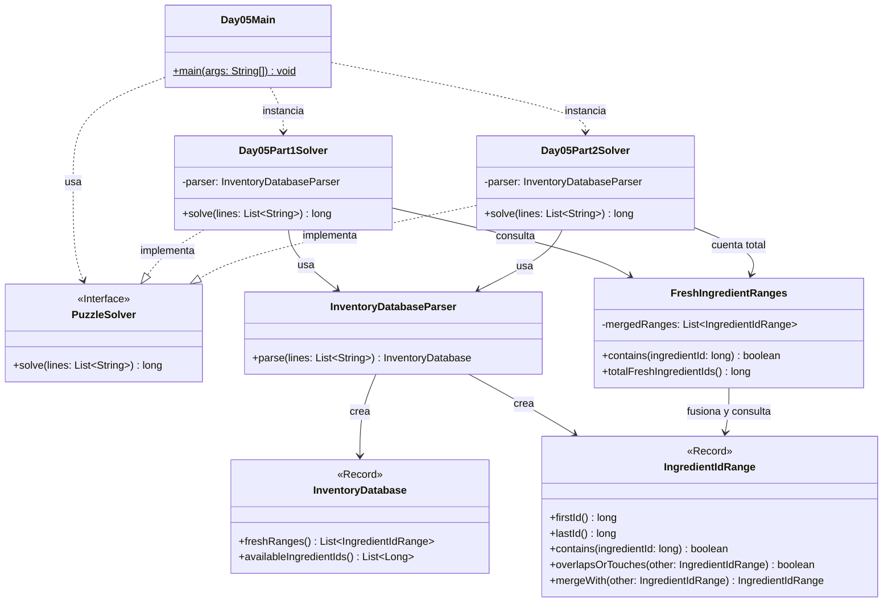

# Advent of Code 2025 - Day 5: Cafeteria

Este proyecto contiene la solución para el **Día 5** del Advent of Code 2025: **Cafeteria**.

El problema consiste en procesar una base de datos de inventario de ingredientes. La base de datos contiene una lista de rangos de IDs considerados frescos, una línea en blanco y una lista de IDs de ingredientes disponibles.

El día está dividido en dos partes:

* **Parte 1**: contar cuántos IDs disponibles son frescos.
* **Parte 2**: contar cuántos IDs distintos son considerados frescos por la unión de todos los rangos.

---

## Descripción del problema

La entrada tiene dos secciones separadas por una línea en blanco.

Ejemplo:

```text
3-5
10-14
16-20
12-18

1
5
8
11
17
32
```

La primera sección contiene rangos de IDs frescos:

```text
3-5
10-14
16-20
12-18
```

La segunda sección contiene IDs disponibles:

```text
1
5
8
11
17
32
```

Los rangos son inclusivos. Por ejemplo:

```text
3-5
```

significa que los IDs `3`, `4` y `5` son frescos.

Los rangos pueden solaparse. Un ingrediente es fresco si pertenece al menos a uno de los rangos.

---

## Parte 1

En la primera parte se deben revisar los IDs disponibles y contar cuántos de ellos están dentro de algún rango fresco.

Con el ejemplo oficial:

```text
ID 1  → spoiled
ID 5  → fresh
ID 8  → spoiled
ID 11 → fresh
ID 17 → fresh
ID 32 → spoiled
```

Por tanto, el resultado es:

```text
3
```

Con el input real del usuario, el resultado de la parte 1 es:

```text
563
```

---

## Parte 2

En la segunda parte, la lista de IDs disponibles deja de ser relevante.

Ahora se pide contar cuántos IDs distintos son considerados frescos por los rangos.

Usando el ejemplo:

```text
3-5
10-14
16-20
12-18
```

Los IDs frescos son:

```text
3, 4, 5,
10, 11, 12, 13, 14, 15, 16, 17, 18, 19, 20
```

Aunque los rangos `10-14`, `16-20` y `12-18` se solapan, los IDs no deben contarse varias veces.

El resultado del ejemplo es:

```text
14
```

Con el input real del usuario, el resultado de la parte 2 es:

```text
338693411431456
```

---

## Diseño y arquitectura

La solución mantiene la estructura modular usada en los días anteriores:

```text
day05
├── Day05Main.java
├── common
├── part1
└── part2
```

El objetivo es separar claramente:

* el punto de entrada del día;
* el modelo común del problema;
* el parser de la base de datos;
* la lógica común de rangos frescos;
* la solución específica de la parte 1;
* la solución específica de la parte 2.

En este día, las clases comunes pueden reutilizarse en ambas partes sin necesidad de duplicarlas.

La única modificación necesaria para la parte 2 es añadir un método a `FreshIngredientRanges` para contar el total de IDs cubiertos por los rangos fusionados. Como es un cambio pequeño y coherente con la responsabilidad de esa clase, no hace falta crear una copia específica para `part2`.

---

## Principios aplicados

### Single Responsibility Principle, SRP

Cada clase tiene una única responsabilidad:

* `Day05Main`: ejecuta el día 5 y muestra los resultados.
* `IngredientIdRange`: representa un rango de IDs de ingredientes.
* `InventoryDatabase`: representa la base de datos completa del problema.
* `InventoryDatabaseParser`: convierte el input textual en una base de datos.
* `FreshIngredientRanges`: gestiona la unión de rangos frescos y permite consultarlos.
* `Day05Part1Solver`: resuelve únicamente la parte 1.
* `Day05Part2Solver`: resuelve únicamente la parte 2.

Esta separación permite modificar, probar y entender cada clase de forma independiente.

---

### Open/Closed Principle, OCP

El diseño permite añadir la parte 2 sin romper la parte 1.

La parte 1 usa `FreshIngredientRanges` para comprobar si un ID disponible es fresco.

La parte 2 reutiliza la misma clase para contar cuántos IDs distintos cubren los rangos frescos.

La clase común se amplía con un método pequeño:

```java
totalFreshIngredientIds()
```

Esto mantiene el sistema abierto a extensión sin introducir cambios invasivos.

---

### Dependency Inversion Principle, DIP

Los solvers implementan la interfaz común:

```java
PuzzleSolver
```

Esto permite tratarlos de forma uniforme desde el `Main`:

```java
PuzzleSolver part1Solver = new Day05Part1Solver();
PuzzleSolver part2Solver = new Day05Part2Solver();
```

El punto de entrada no necesita conocer los detalles internos de cada solver.

---

### DRY

La lógica común del día 5 se mantiene en:

```text
es.ulpgc.aoc2025.day05.common
```

Aquí se encuentran:

* `IngredientIdRange`
* `InventoryDatabase`
* `InventoryDatabaseParser`
* `FreshIngredientRanges`

Así se evita duplicar el parser, la representación de rangos o la lógica de fusión de intervalos.

---

### Código expresivo

El código intenta representar directamente los conceptos del problema.

Por ejemplo:

* `IngredientIdRange` representa un rango de IDs.
* `InventoryDatabase` representa la base de datos del inventario.
* `FreshIngredientRanges` representa el conjunto de rangos frescos ya procesados.
* `contains` expresa si un ID pertenece a algún rango fresco.
* `totalFreshIngredientIds` expresa cuántos IDs distintos son frescos.

---

## Estructura del proyecto

```text
src
├── main
│   ├── java
│   │   └── es
│   │       └── ulpgc
│   │           └── aoc2025
│   │               ├── common
│   │               │   └── PuzzleSolver.java
│   │               │
│   │               └── day05
│   │                   ├── Day05Main.java
│   │                   │
│   │                   ├── common
│   │                   │   ├── FreshIngredientRanges.java
│   │                   │   ├── IngredientIdRange.java
│   │                   │   ├── InventoryDatabase.java
│   │                   │   └── InventoryDatabaseParser.java
│   │                   │
│   │                   ├── part1
│   │                   │   └── Day05Part1Solver.java
│   │                   │
│   │                   └── part2
│   │                       └── Day05Part2Solver.java
│   │
│   └── resources
│       └── day05
│           └── input.txt
│
└── test
    └── java
        └── es
            └── ulpgc
                └── aoc2025
                    └── day05
                        ├── part1
                        │   └── Day05Part1SolverTest.java
                        └── part2
                            └── Day05Part2SolverTest.java
```

---

## Paquetes principales

### `es.ulpgc.aoc2025.common`

Contiene código común a todo el proyecto Advent of Code.

Actualmente contiene:

```text
PuzzleSolver.java
```

Esta interfaz define el contrato general que deben cumplir todos los solvers:

```java
long solve(List<String> lines);
```

---

### `es.ulpgc.aoc2025.day05`

Contiene el punto de entrada específico del día 5:

```text
Day05Main.java
```

Esta clase se encarga de:

1. leer el archivo de entrada;
2. crear el solver de la parte 1;
3. crear el solver de la parte 2;
4. ejecutar ambos solvers;
5. mostrar los resultados por consola.

---

### `es.ulpgc.aoc2025.day05.common`

Contiene las clases comunes del dominio del día 5.

Estas clases son compartidas por ambas partes porque representan conceptos generales del problema.

---

### `es.ulpgc.aoc2025.day05.part1`

Contiene la solución específica de la primera parte.

---

### `es.ulpgc.aoc2025.day05.part2`

Contiene la solución específica de la segunda parte.

---

## Clases principales

### `IngredientIdRange`

Representa un rango inclusivo de IDs de ingredientes.

Se implementa como `record` porque es un objeto de datos inmutable formado por dos valores:

```java
package es.ulpgc.aoc2025.day05.common;

public record IngredientIdRange(long firstId, long lastId) {

    public IngredientIdRange {
        if (firstId < 0) {
            throw new IllegalArgumentException("First id cannot be negative");
        }

        if (lastId < 0) {
            throw new IllegalArgumentException("Last id cannot be negative");
        }

        if (firstId > lastId) {
            throw new IllegalArgumentException("First id cannot be greater than last id");
        }
    }

    public boolean contains(long ingredientId) {
        return firstId <= ingredientId && ingredientId <= lastId;
    }

    public boolean overlapsOrTouches(IngredientIdRange other) {
        return this.firstId <= other.lastId + 1
                && other.firstId <= this.lastId + 1;
    }

    public IngredientIdRange mergeWith(IngredientIdRange other) {
        if (!overlapsOrTouches(other)) {
            throw new IllegalArgumentException("Ranges do not overlap or touch");
        }

        return new IngredientIdRange(
                Math.min(this.firstId, other.firstId),
                Math.max(this.lastId, other.lastId)
        );
    }
}
```

Responsabilidades:

* almacenar el inicio y fin del rango;
* validar que el rango sea correcto;
* comprobar si un ID pertenece al rango;
* comprobar si dos rangos se solapan o son consecutivos;
* fusionar dos rangos compatibles.

---

### `InventoryDatabase`

Representa la base de datos completa del problema.

```java
package es.ulpgc.aoc2025.day05.common;

import java.util.List;

public record InventoryDatabase(
        List<IngredientIdRange> freshRanges,
        List<Long> availableIngredientIds
) {

    public InventoryDatabase {
        if (freshRanges == null) {
            throw new IllegalArgumentException("Fresh ranges cannot be null");
        }

        if (availableIngredientIds == null) {
            throw new IllegalArgumentException("Available ingredient ids cannot be null");
        }

        freshRanges = List.copyOf(freshRanges);
        availableIngredientIds = List.copyOf(availableIngredientIds);
    }
}
```

Aunque la parte 2 ignora los IDs disponibles, la estructura completa sigue siendo útil porque representa fielmente el formato del input.

---

### `InventoryDatabaseParser`

Convierte las líneas del input en un `InventoryDatabase`.

```java
package es.ulpgc.aoc2025.day05.common;

import java.util.ArrayList;
import java.util.List;

public class InventoryDatabaseParser {

    public InventoryDatabase parse(List<String> lines) {
        List<IngredientIdRange> freshRanges = new ArrayList<>();
        List<Long> availableIngredientIds = new ArrayList<>();

        boolean readingAvailableIds = false;

        for (String line : lines) {
            if (line.isBlank()) {
                readingAvailableIds = true;
                continue;
            }

            if (readingAvailableIds) {
                availableIngredientIds.add(Long.parseLong(line.trim()));
            } else {
                freshRanges.add(parseRange(line.trim()));
            }
        }

        return new InventoryDatabase(freshRanges, availableIngredientIds);
    }

    private IngredientIdRange parseRange(String line) {
        String[] bounds = line.split("-");

        if (bounds.length != 2) {
            throw new IllegalArgumentException("Invalid range: " + line);
        }

        long firstId = Long.parseLong(bounds[0]);
        long lastId = Long.parseLong(bounds[1]);

        return new IngredientIdRange(firstId, lastId);
    }
}
```

Su responsabilidad es únicamente interpretar el formato del archivo.

No decide qué ingredientes son frescos ni calcula resultados.

---

### `FreshIngredientRanges`

Representa la colección de rangos frescos ya fusionados.

```java
package es.ulpgc.aoc2025.day05.common;

import java.util.ArrayList;
import java.util.Comparator;
import java.util.List;

public class FreshIngredientRanges {

    private final List<IngredientIdRange> mergedRanges;

    public FreshIngredientRanges(List<IngredientIdRange> ranges) {
        this.mergedRanges = merge(ranges);
    }

    public boolean contains(long ingredientId) {
        int left = 0;
        int right = mergedRanges.size() - 1;

        while (left <= right) {
            int middle = left + (right - left) / 2;
            IngredientIdRange range = mergedRanges.get(middle);

            if (range.contains(ingredientId)) {
                return true;
            }

            if (ingredientId < range.firstId()) {
                right = middle - 1;
            } else {
                left = middle + 1;
            }
        }

        return false;
    }

    // Añadido para la parte 2.
    // Devuelve cuántos IDs distintos son considerados frescos por la unión de rangos.
    public long totalFreshIngredientIds() {
        long total = 0;

        for (IngredientIdRange range : mergedRanges) {
            total += range.lastId() - range.firstId() + 1;
        }

        return total;
    }

    private List<IngredientIdRange> merge(List<IngredientIdRange> ranges) {
        if (ranges.isEmpty()) {
            return List.of();
        }

        List<IngredientIdRange> sortedRanges = ranges.stream()
                .sorted(Comparator.comparingLong(IngredientIdRange::firstId))
                .toList();

        List<IngredientIdRange> merged = new ArrayList<>();
        IngredientIdRange current = sortedRanges.getFirst();

        for (int i = 1; i < sortedRanges.size(); i++) {
            IngredientIdRange next = sortedRanges.get(i);

            if (current.overlapsOrTouches(next)) {
                current = current.mergeWith(next);
            } else {
                merged.add(current);
                current = next;
            }
        }

        merged.add(current);

        return List.copyOf(merged);
    }
}
```

Responsabilidades:

* ordenar los rangos;
* fusionar rangos solapados o consecutivos;
* comprobar si un ID pertenece a algún rango fresco;
* contar cuántos IDs distintos son frescos.

---

### `Day05Part1Solver`

Resuelve la primera parte del problema.

Su algoritmo es:

1. parsear la base de datos;
2. fusionar los rangos frescos;
3. recorrer los IDs disponibles;
4. contar cuántos están dentro de algún rango fresco.

---

### `Day05Part2Solver`

Resuelve la segunda parte del problema.

Su algoritmo es:

1. parsear la base de datos;
2. ignorar los IDs disponibles;
3. fusionar los rangos frescos;
4. contar cuántos IDs distintos cubren los rangos fusionados.

---

## Estrategia de resolución

### Parte 1

Una solución directa sería comprobar cada ID disponible contra todos los rangos originales.

Sin embargo, como los rangos pueden solaparse, primero se fusionan.

Ejemplo:

```text
10-14
16-20
12-18
```

se convierte en:

```text
10-20
```

Después, para comprobar si un ID es fresco, se usa búsqueda binaria sobre los rangos fusionados.

Esto evita recorrer todos los rangos para cada ID disponible.

---

### Parte 2

En la parte 2 no se usan los IDs disponibles.

Solo se necesita saber cuántos IDs distintos cubren los rangos frescos.

Después de fusionar los rangos, se calcula el tamaño de cada rango:

```text
lastId - firstId + 1
```

y se suman todos los tamaños.

Ejemplo:

```text
3-5      → 3 IDs
10-20    → 11 IDs
```

Total:

```text
14
```

---

## Diagrama de arquitectura



---

## Entrada del programa

El archivo de entrada debe colocarse en:

```text
src/main/resources/day05/input.txt
```

El contenido debe respetar el formato:

```text
<rangos frescos>

<ids disponibles>
```

Ejemplo:

```text
3-5
10-14
16-20
12-18

1
5
8
11
17
32
```

---

## Ejecución en IntelliJ IDEA

Para ejecutar el día 5:

1. abrir el archivo:

```text
src/main/java/es/ulpgc/aoc2025/day05/Day05Main.java
```

2. pulsar el botón verde junto al método `main`;

3. seleccionar:

```text
Run 'Day05Main.main()'
```

La salida tendrá este formato:

```text
Day 05 - Part 1: 563
Day 05 - Part 2: 338693411431456
```

---

## Ejecución con Maven

Para ejecutar los tests:

```bash
mvn test
```

---

## Tests

El proyecto incluye tests separados para cada parte:

```text
Day05Part1SolverTest.java
Day05Part2SolverTest.java
```

Los tests usan el ejemplo oficial:

```text
3-5
10-14
16-20
12-18

1
5
8
11
17
32
```

Resultado esperado para la parte 1:

```text
3
```

Resultado esperado para la parte 2:

```text
14
```

---

## Convención para próximos días

Cada día del Advent of Code seguirá la misma estructura:

```text
dayXX
├── DayXXMain.java
├── common
├── part1
└── part2
```

Ejemplo para el día 6:

```text
day06
├── Day06Main.java
├── common
├── part1
└── part2
```

Cuando una clase pueda compartirse sin modificar su comportamiento, se coloca en `common`.

Cuando una parte requiera modificar mucho el comportamiento de una clase común, se crea una clase específica dentro de `part1` o `part2`.

Cuando el cambio sea pequeño y coherente con la responsabilidad de la clase, se añade directamente a la clase común y se marca con un comentario.

---

## Conclusión

La solución del día 5 está organizada para separar claramente el parsing, el modelo del dominio y la lógica específica de cada parte.

La clase `FreshIngredientRanges` centraliza la lógica de fusión y consulta de rangos frescos. Esto evita duplicación, mejora la eficiencia y permite resolver ambas partes reutilizando el mismo modelo común.

La parte 1 cuenta cuántos IDs disponibles son frescos, mientras que la parte 2 cuenta cuántos IDs distintos cubren los rangos frescos.

Esta estructura mantiene el proyecto modular, fácil de probar y preparado para seguir añadiendo nuevos días.
