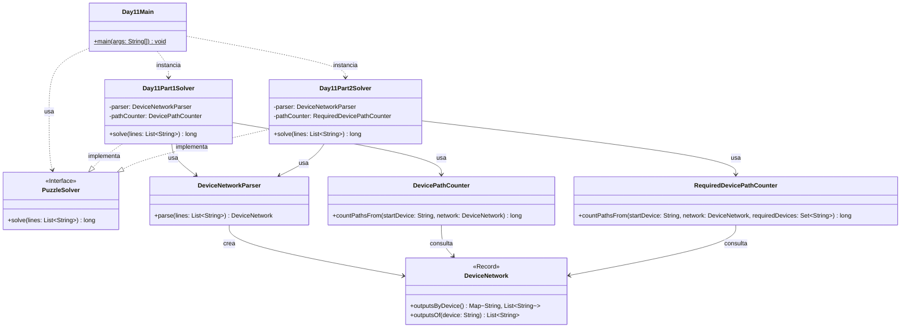

# Advent of Code 2025 - Day 11: Reactor

Este proyecto contiene la solución para el **Día 11** del Advent of Code 2025: **Reactor**.

El problema consiste en analizar una red de dispositivos conectados entre sí. Cada dispositivo tiene una o más salidas hacia otros dispositivos, y los datos solo pueden avanzar siguiendo esas salidas.

La red puede interpretarse como un **grafo dirigido**:

```text
dispositivo → dispositivos de salida
```

El día está dividido en dos partes:

* **Parte 1**: contar todos los caminos desde `you` hasta `out`.
* **Parte 2**: contar todos los caminos desde `svr` hasta `out` que pasen obligatoriamente por `dac` y `fft`.

---

## Descripción del problema

Cada línea del input describe un dispositivo y sus salidas.

Ejemplo:

```text
aaa: you hhh
you: bbb ccc
bbb: ddd eee
ccc: ddd eee fff
ddd: ggg
eee: out
fff: out
ggg: out
hhh: ccc fff iii
iii: out
```

La línea:

```text
bbb: ddd eee
```

significa que el dispositivo `bbb` tiene dos salidas:

```text
bbb → ddd
bbb → eee
```

Los datos solo pueden avanzar en el sentido indicado. No pueden ir hacia atrás.

---

## Parte 1

En la primera parte se deben contar todos los caminos posibles desde:

```text
you
```

hasta:

```text
out
```

En el ejemplo oficial, los caminos son:

```text
you → bbb → ddd → ggg → out
you → bbb → eee → out
you → ccc → ddd → ggg → out
you → ccc → eee → out
you → ccc → fff → out
```

Por tanto, el resultado del ejemplo es:

```text
5
```

---

## Parte 2

En la segunda parte cambia el origen y se añaden dos dispositivos obligatorios.

Ahora se deben contar los caminos desde:

```text
svr
```

hasta:

```text
out
```

pero solo son válidos los caminos que visitan ambos dispositivos:

```text
dac
fft
```

El orden no importa. Un camino puede pasar primero por `dac` y luego por `fft`, o primero por `fft` y luego por `dac`.

En el ejemplo oficial de la parte 2, existen varios caminos desde `svr` hasta `out`, pero solo dos de ellos pasan por ambos dispositivos obligatorios.

Resultado del ejemplo:

```text
2
```

---

## Diseño y arquitectura

La solución mantiene la estructura modular usada en los días anteriores:

```text
day11
├── Day11Main.java
├── common
├── part1
└── part2
```

La parte común contiene el modelo de la red y el parser.

Las partes 1 y 2 tienen contadores separados porque la condición de búsqueda cambia bastante:

```text
Parte 1 → contar todos los caminos desde you hasta out
Parte 2 → contar caminos desde svr hasta out que pasen por dac y fft
```

Por tanto, no se modifica el contador de la parte 1. Se crea un contador específico para la parte 2.

---

## Decisión de diseño tras añadir la parte 2

En la parte 1 se usa:

```text
DevicePathCounter
```

Esta clase cuenta caminos desde un dispositivo inicial hasta `out`.

En la parte 2 se añade:

```text
RequiredDevicePathCounter
```

Esta clase cuenta caminos que, además de llegar a `out`, deben haber visitado una serie de dispositivos obligatorios.

La parte 2 no es una pequeña modificación de la parte 1 porque ahora el estado de búsqueda no depende solo del dispositivo actual, sino también de los dispositivos obligatorios ya visitados.

En la parte 1, el estado es:

```text
device
```

En la parte 2, el estado es:

```text
device + dispositivos obligatorios visitados
```

Por eso se crea una clase específica en `part2`.

---

## Principios aplicados

### Single Responsibility Principle, SRP

Cada clase tiene una responsabilidad clara:

* `Day11Main`: ejecuta el día 11 y muestra los resultados.
* `DeviceNetwork`: representa la red de dispositivos.
* `DeviceNetworkParser`: convierte el input textual en una red de dispositivos.
* `DevicePathCounter`: cuenta caminos simples desde un origen hasta `out`.
* `RequiredDevicePathCounter`: cuenta caminos que deben pasar por dispositivos obligatorios.
* `Day11Part1Solver`: resuelve únicamente la parte 1.
* `Day11Part2Solver`: resuelve únicamente la parte 2.

---

### Open/Closed Principle, OCP

La parte 2 se añade sin modificar la lógica específica de la parte 1.

La clase de la parte 1 permanece estable:

```text
DevicePathCounter
```

La parte 2 introduce una clase nueva:

```text
RequiredDevicePathCounter
```

Así, el código existente queda cerrado a modificaciones innecesarias, pero el sistema sigue abierto a extensión.

---

### Dependency Inversion Principle, DIP

Los solvers implementan la interfaz común:

```java
PuzzleSolver
```

Esto permite tratarlos de forma uniforme desde el `Main`:

```java
PuzzleSolver part1Solver = new Day11Part1Solver();
PuzzleSolver part2Solver = new Day11Part2Solver();
```

El punto de entrada no necesita conocer los detalles internos del algoritmo de cada parte.

---

### DRY

El parser y el modelo de red se comparten entre ambas partes:

```text
DeviceNetwork
DeviceNetworkParser
```

La lógica específica de cada parte se mantiene separada:

```text
DevicePathCounter         → parte 1
RequiredDevicePathCounter → parte 2
```

Así se evita duplicar el parsing o mezclar reglas distintas en una misma clase.

---

## Estructura del proyecto

```text
src
├── main
│   ├── java
│   │   └── es
│   │       └── ulpgc
│   │           └── aoc2025
│   │               ├── common
│   │               │   └── PuzzleSolver.java
│   │               │
│   │               └── day11
│   │                   ├── Day11Main.java
│   │                   │
│   │                   ├── common
│   │                   │   ├── DeviceNetwork.java
│   │                   │   └── DeviceNetworkParser.java
│   │                   │
│   │                   ├── part1
│   │                   │   ├── Day11Part1Solver.java
│   │                   │   └── DevicePathCounter.java
│   │                   │
│   │                   └── part2
│   │                       ├── Day11Part2Solver.java
│   │                       └── RequiredDevicePathCounter.java
│   │
│   └── resources
│       └── day11
│           └── input.txt
│
└── test
    └── java
        └── es
            └── ulpgc
                └── aoc2025
                    └── day11
                        ├── part1
                        │   └── Day11Part1SolverTest.java
                        └── part2
                            └── Day11Part2SolverTest.java
```

---

## Paquetes principales

### `es.ulpgc.aoc2025.common`

Contiene código común a todo el proyecto Advent of Code.

Actualmente contiene:

```text
PuzzleSolver.java
```

Esta interfaz define el contrato común de todos los solvers:

```java
long solve(List<String> lines);
```

---

### `es.ulpgc.aoc2025.day11`

Contiene el punto de entrada específico del día 11:

```text
Day11Main.java
```

Esta clase se encarga de:

1. leer el archivo de entrada;
2. crear el solver de la parte 1;
3. crear el solver de la parte 2;
4. ejecutar ambos solvers;
5. mostrar los resultados por consola.

---

### `es.ulpgc.aoc2025.day11.common`

Contiene las clases comunes del dominio del día 11.

Estas clases se reutilizan en ambas partes.

---

### `es.ulpgc.aoc2025.day11.part1`

Contiene la solución específica de la primera parte.

---

### `es.ulpgc.aoc2025.day11.part2`

Contiene la solución específica de la segunda parte.

---

## Clases principales

### `DeviceNetwork`

Representa la red de dispositivos.

```java
package es.ulpgc.aoc2025.day11.common;

import java.util.List;
import java.util.Map;

public record DeviceNetwork(Map<String, List<String>> outputsByDevice) {

    public DeviceNetwork {
        if (outputsByDevice == null) {
            throw new IllegalArgumentException("Outputs by device cannot be null");
        }

        outputsByDevice = Map.copyOf(outputsByDevice);
    }

    public List<String> outputsOf(String device) {
        return outputsByDevice.getOrDefault(device, List.of());
    }
}
```

Responsabilidades:

* almacenar las salidas de cada dispositivo;
* permitir consultar a qué dispositivos puede enviar datos un dispositivo dado.

---

### `DeviceNetworkParser`

Convierte las líneas del input en un `DeviceNetwork`.

```java
package es.ulpgc.aoc2025.day11.common;

import java.util.ArrayList;
import java.util.HashMap;
import java.util.List;
import java.util.Map;

public class DeviceNetworkParser {

    public DeviceNetwork parse(List<String> lines) {
        Map<String, List<String>> outputsByDevice = new HashMap<>();

        for (String line : lines) {
            if (line.isBlank()) {
                continue;
            }

            parseConnectionLine(line.trim(), outputsByDevice);
        }

        return new DeviceNetwork(outputsByDevice);
    }

    private void parseConnectionLine(
            String line,
            Map<String, List<String>> outputsByDevice
    ) {
        String[] parts = line.split(":");

        if (parts.length != 2) {
            throw new IllegalArgumentException("Invalid device line: " + line);
        }

        String device = parts[0].trim();
        String outputsText = parts[1].trim();

        if (device.isEmpty()) {
            throw new IllegalArgumentException("Device name cannot be empty");
        }

        outputsByDevice.put(device, parseOutputs(outputsText));
    }

    private List<String> parseOutputs(String outputsText) {
        if (outputsText.isBlank()) {
            return List.of();
        }

        String[] rawOutputs = outputsText.split("\\s+");
        List<String> outputs = new ArrayList<>();

        for (String output : rawOutputs) {
            outputs.add(output.trim());
        }

        return outputs;
    }
}
```

Responsabilidades:

* ignorar líneas vacías;
* separar cada línea por `:`;
* extraer el dispositivo origen;
* extraer los dispositivos de salida;
* crear la red dirigida.

---

### `DevicePathCounter`

Resuelve la lógica de la parte 1.

Su algoritmo es:

1. empezar desde `you`;
2. recorrer las salidas del dispositivo actual;
3. si se llega a `out`, contar un camino;
4. usar memoización para no recalcular caminos desde el mismo dispositivo.

La relación recursiva es:

```text
paths(device) = suma de paths(output)
paths(out) = 1
```

Ejemplo:

```java
paths("you") = paths("bbb") + paths("ccc")
```

---

### `RequiredDevicePathCounter`

Resuelve la lógica de la parte 2.

Su algoritmo es:

1. empezar desde `svr`;
2. avanzar por las salidas del dispositivo actual;
3. mantener el estado de qué dispositivos obligatorios ya se visitaron;
4. al llegar a `out`, contar el camino solo si se han visitado todos los dispositivos obligatorios;
5. usar memoización sobre el estado completo.

El estado de búsqueda es:

```text
dispositivo actual
+
dispositivos obligatorios visitados
```

Por ejemplo:

```text
ccc, sin haber visitado dac ni fft
ccc, habiendo visitado dac
ccc, habiendo visitado fft
ccc, habiendo visitado dac y fft
```

Estos estados no son equivalentes, por lo que deben memorizarse por separado.

---

## Estrategia de resolución

### Parte 1: DFS con memoización

Se usa una búsqueda en profundidad desde `you`.

Cuando se alcanza `out`, se devuelve `1`.

Cuando un dispositivo no tiene camino hacia `out`, devuelve `0`.

Para evitar trabajo repetido, se guarda en un mapa cuántos caminos hay desde cada dispositivo hasta `out`.

Ejemplo conceptual:

```text
memo["eee"] = 1
memo["fff"] = 1
memo["ggg"] = 1
memo["ddd"] = 1
memo["bbb"] = 2
memo["ccc"] = 3
memo["you"] = 5
```

---

### Parte 2: DFS con estado extendido

En la parte 2 no basta con saber en qué dispositivo estamos.

También hay que saber si el camino ya ha pasado por:

```text
dac
fft
```

Por eso, al visitar un dispositivo, se actualiza el estado.

Si el dispositivo actual es `dac`, se marca `dac` como visitado.

Si el dispositivo actual es `fft`, se marca `fft` como visitado.

Al llegar a `out`, el camino solo cuenta si ambos están visitados.

---

## Diagrama de arquitectura



---

## Entrada del programa

El archivo de entrada debe colocarse en:

```text
src/main/resources/day11/input.txt
```

El formato debe ser:

```text
device: output1 output2 output3
device: output1 output2
device: output1
...
```

Ejemplo:

```text
you: bbb ccc
bbb: ddd eee
ccc: ddd eee fff
ddd: ggg
eee: out
fff: out
ggg: out
```

---

## Ejecución en IntelliJ IDEA

Para ejecutar el día 11:

1. abrir el archivo:

```text
src/main/java/es/ulpgc/aoc2025/day11/Day11Main.java
```

2. pulsar el botón verde junto al método `main`;

3. seleccionar:

```text
Run 'Day11Main.main()'
```

La salida tendrá este formato:

```text
Day 11 - Part 1: <resultado_parte_1>
Day 11 - Part 2: <resultado_parte_2>
```

---

## Ejecución con Maven

Para ejecutar los tests:

```bash
mvn test
```

---

## Tests

El proyecto incluye tests separados para cada parte:

```text
Day11Part1SolverTest.java
Day11Part2SolverTest.java
```

---

### Test de la parte 1

El test de la parte 1 usa el ejemplo oficial:

```text
aaa: you hhh
you: bbb ccc
bbb: ddd eee
ccc: ddd eee fff
ddd: ggg
eee: out
fff: out
ggg: out
hhh: ccc fff iii
iii: out
```

Resultado esperado:

```text
5
```

---

### Test de la parte 2

El test de la parte 2 usa el ejemplo oficial:

```text
svr: aaa bbb
aaa: fft
fft: ccc
bbb: tty
tty: ccc
ccc: ddd eee
ddd: hub
hub: fff
eee: dac
dac: fff
fff: ggg hhh
ggg: out
hhh: out
```

Resultado esperado:

```text
2
```

---

## Rendimiento

El número de caminos puede crecer muy rápido en un grafo dirigido.

Por eso es importante usar memoización.

Sin memoización, se podrían recalcular los mismos subcaminos muchas veces.

Con memoización, cada estado se calcula una vez:

```text
Parte 1:
device

Parte 2:
device + requiredDevicesVisited
```

En la parte 2, como solo hay dos dispositivos obligatorios (`dac` y `fft`), el número de estados posibles por dispositivo es pequeño.

---

## Nota sobre ciclos

El enunciado indica que los datos fluyen a través de las salidas y no hacia atrás, pero aun así la implementación puede incluir una protección contra ciclos.

Si durante una búsqueda se vuelve a visitar el mismo estado antes de terminarlo, se lanza una excepción indicando que existe un ciclo.

Esto ayuda a detectar errores en el input o en el parser.

---

## Nota sobre valores grandes

El contador usa `long`.

Si el número de caminos superase el límite de `long`, habría que cambiar el contador para usar:

```text
BigInteger
```

Sin embargo, mientras el proyecto mantenga la interfaz común:

```java
long solve(List<String> lines);
```

se mantiene `long` para ser consistente con el resto de días.

---

## Convención para próximos días

Cada día del Advent of Code seguirá la misma estructura:

```text
dayXX
├── DayXXMain.java
├── common
├── part1
└── part2
```

Ejemplo para el día 12:

```text
day12
├── Day12Main.java
├── common
├── part1
└── part2
```

Cuando una clase pueda compartirse sin modificar su comportamiento, se coloca en `common`.

Cuando una parte requiera modificar mucho el comportamiento de una clase existente, se crea una clase específica dentro de `part1` o `part2`.

Cuando el cambio sea pequeño y coherente con la responsabilidad de la clase, se añade directamente a la clase común y se marca con un comentario.

En este día:

```text
DeviceNetwork → common
DeviceNetworkParser → common
DevicePathCounter → específico de part1
RequiredDevicePathCounter → específico de part2
```

---

## Conclusión

La solución del día 11 se basa en modelar la entrada como un grafo dirigido.

La parte 1 cuenta todos los caminos desde `you` hasta `out` usando DFS con memoización.

La parte 2 amplía la búsqueda añadiendo estado sobre si ya se han visitado `dac` y `fft`.

Como la condición de validez cambia de forma importante, se mantiene el contador de la parte 1 separado y se crea un contador específico para la parte 2. Esto permite conservar una estructura modular, expresiva y fácil de extender.
