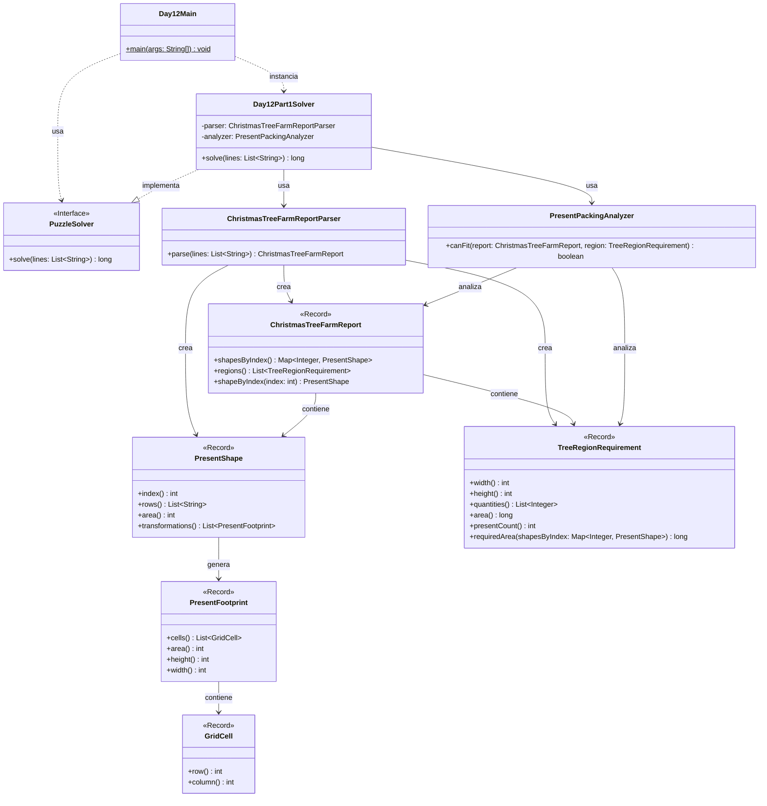

# Advent of Code 2025 - Day 12: Christmas Tree Farm

Este proyecto contiene la solución para el **Día 12** del Advent of Code 2025: **Christmas Tree Farm**.

A diferencia de otros días anteriores, este día solo tiene una parte. Por tanto, la estructura mantiene los paquetes `common` y `part1`, pero no se crea un paquete `part2`.

El problema consiste en determinar cuántas regiones bajo árboles de Navidad pueden contener todos los regalos indicados. Cada regalo tiene una forma concreta, puede rotarse y reflejarse, y debe colocarse sobre una cuadrícula bidimensional sin solaparse con otros regalos.

---

## Descripción del problema

La entrada se divide en dos secciones.

La primera sección contiene las formas estándar de los regalos.

Ejemplo:

```text id="bp3hmr"
0:
###
##.
##.

1:
###
##.
.##
```

Cada forma empieza con su índice seguido de dos puntos:

```text id="gt5f81"
0:
```

Después aparece la forma visual del regalo.

En la representación:

```text id="ziwf3m"
# → celda ocupada por el regalo
. → celda vacía dentro de su caja visual
```

La segunda sección contiene las regiones bajo los árboles y la cantidad de regalos de cada forma que deben colocarse.

Ejemplo:

```text id="1m28zu"
4x4: 0 0 0 0 2 0
12x5: 1 0 1 0 2 2
12x5: 1 0 1 0 3 2
```

Una línea como:

```text id="wmmfim"
12x5: 1 0 1 0 2 2
```

significa:

```text id="degtvz"
región de anchura 12
región de altura 5

1 regalo de la forma 0
0 regalos de la forma 1
1 regalo de la forma 2
0 regalos de la forma 3
2 regalos de la forma 4
2 regalos de la forma 5
```

---

## Objetivo

Para cada región, hay que decidir si todos los regalos indicados pueden colocarse dentro de ella.

Los regalos:

* pueden rotarse;
* pueden voltearse;
* deben colocarse alineados con la cuadrícula;
* no pueden solaparse en las celdas `#`;
* sí pueden encajar usando los huecos `.` de otras formas, porque esos huecos no ocupan espacio real.

La respuesta final es:

```text id="0df90h"
¿Cuántas regiones pueden contener todos los regalos indicados?
```

---

## Resultado

Con el ejemplo oficial, el resultado es:

```text id="93cpur"
2
```

Con el input real del usuario, el resultado es:

```text id="a7xjmn"
544
```

La salida esperada del programa es:

```text id="ggii7r"
Day 12 - Part 1: 544
```

---

## Diseño general

La solución mantiene la estructura usada en el resto del proyecto Advent of Code:

```text id="9p7kt6"
day12
├── Day12Main.java
├── common
└── part1
```

Como este día solo tiene una parte, no se crea `part2`.

La separación queda así:

```text id="dnjiqs"
common → modelo del problema y parser
part1  → lógica concreta para comprobar si los regalos caben
```

---

## Estructura del proyecto

```text id="a61pez"
src
├── main
│   ├── java
│   │   └── es
│   │       └── ulpgc
│   │           └── aoc2025
│   │               ├── common
│   │               │   └── PuzzleSolver.java
│   │               │
│   │               └── day12
│   │                   ├── Day12Main.java
│   │                   │
│   │                   ├── common
│   │                   │   ├── ChristmasTreeFarmReport.java
│   │                   │   ├── ChristmasTreeFarmReportParser.java
│   │                   │   ├── GridCell.java
│   │                   │   ├── PresentFootprint.java
│   │                   │   ├── PresentShape.java
│   │                   │   └── TreeRegionRequirement.java
│   │                   │
│   │                   └── part1
│   │                       ├── Day12Part1Solver.java
│   │                       └── PresentPackingAnalyzer.java
│   │
│   └── resources
│       └── day12
│           └── input.txt
│
└── test
    └── java
        └── es
            └── ulpgc
                └── aoc2025
                    └── day12
                        └── part1
                            └── Day12Part1SolverTest.java
```

---

## Paquetes principales

### `es.ulpgc.aoc2025.common`

Contiene código común a todo el proyecto.

Actualmente contiene la interfaz:

```text id="n2md4r"
PuzzleSolver.java
```

Esta interfaz define el contrato común de todos los solvers:

```java id="nuzwpz"
long solve(List<String> lines);
```

---

### `es.ulpgc.aoc2025.day12`

Contiene el punto de entrada específico del día 12:

```text id="hvc991"
Day12Main.java
```

Esta clase se encarga de:

1. leer el archivo de entrada;
2. crear el solver de la parte 1;
3. ejecutar el solver;
4. mostrar el resultado por consola.

---

### `es.ulpgc.aoc2025.day12.common`

Contiene las clases comunes del dominio del día 12.

Aquí se modelan:

* las formas de los regalos;
* las celdas ocupadas;
* las transformaciones de las piezas;
* las regiones bajo los árboles;
* el informe completo del problema;
* el parser del input.

---

### `es.ulpgc.aoc2025.day12.part1`

Contiene la solución específica de la única parte del día.

Aquí se encuentra la lógica que decide si una región puede contener todos los regalos indicados.

---

## Clases principales

### `GridCell`

Representa una celda de la cuadrícula.

```java id="wz1nk1"
package es.ulpgc.aoc2025.day12.common;

public record GridCell(int row, int column) {
}
```

Se usa para representar las posiciones ocupadas por cada regalo.

---

### `PresentFootprint`

Representa la huella real de una forma de regalo.

La huella contiene únicamente las celdas ocupadas por `#`.

Por ejemplo, esta forma:

```text id="2upg5m"
###
#..
###
```

tiene siete celdas ocupadas.

Responsabilidades:

* almacenar las celdas ocupadas;
* calcular el área real de la pieza;
* calcular la anchura ocupada;
* calcular la altura ocupada.

---

### `PresentShape`

Representa una forma de regalo leída desde el input.

Responsabilidades:

* almacenar el índice de la forma;
* almacenar su representación visual;
* calcular el área ocupada;
* generar todas sus transformaciones posibles.

Las transformaciones incluyen:

```text id="y6wbbr"
rotaciones
volteos
```

Esto es necesario porque el enunciado permite colocar los regalos rotados o reflejados.

---

### `TreeRegionRequirement`

Representa una región bajo un árbol.

Una región contiene:

```text id="msplku"
anchura
altura
cantidades de cada forma de regalo
```

Ejemplo:

```text id="y5852c"
12x5: 1 0 1 0 2 2
```

se modela como:

```text id="62t6jq"
width = 12
height = 5
quantities = [1, 0, 1, 0, 2, 2]
```

Responsabilidades:

* calcular el área disponible de la región;
* calcular cuántos regalos hay que colocar;
* calcular el área total requerida por los regalos.

---

### `ChristmasTreeFarmReport`

Representa el informe completo del problema.

Contiene:

```text id="pv6zq3"
formas de regalos
regiones bajo árboles
```

Responsabilidades:

* almacenar las formas indexadas;
* almacenar la lista de regiones;
* permitir recuperar una forma por su índice.

---

### `ChristmasTreeFarmReportParser`

Convierte el input textual en un `ChristmasTreeFarmReport`.

Responsabilidades:

* leer las formas de regalos;
* leer las regiones;
* separar correctamente ambas secciones;
* construir los objetos del dominio.

---

### `PresentPackingAnalyzer`

Resuelve la lógica principal de la parte 1.

Esta clase decide si una región puede contener todos los regalos indicados.

Su flujo general es:

1. calcular el área total ocupada por los regalos;
2. comparar esa área con el área disponible de la región;
3. descartar rápidamente las regiones imposibles;
4. comprobar si las piezas pueden colocarse sin solaparse;
5. contar la región como válida si todos los regalos caben.

---

### `Day12Part1Solver`

Implementa la interfaz `PuzzleSolver`.

Responsabilidades:

* parsear el input;
* recorrer todas las regiones;
* usar `PresentPackingAnalyzer` para comprobar cada región;
* contar cuántas regiones son válidas.

---

## Estrategia de resolución

### 1. Parsing del input

El parser lee primero las formas.

Cada forma tiene este patrón:

```text id="5iv61y"
índice:
fila
fila
fila
```

Ejemplo:

```text id="7wakmn"
4:
###
#..
###
```

Después lee las regiones:

```text id="hshbol"
anchuraxaltura: cantidades
```

Ejemplo:

```text id="l0wsmv"
4x4: 0 0 0 0 2 0
```

---

### 2. Cálculo de áreas

Antes de intentar colocar regalos, se calcula el área total requerida.

Si los regalos ocupan más celdas de las que tiene la región, la región se descarta inmediatamente.

Ejemplo:

```text id="on20c0"
área requerida > área disponible → imposible
```

Este filtro es muy barato y elimina muchos casos imposibles.

---

### 3. Transformaciones de las piezas

Cada forma puede aparecer en distintas orientaciones.

Para cada forma se generan sus posibles transformaciones:

```text id="xzqsfs"
rotación 0º
rotación 90º
rotación 180º
rotación 270º
volteos
```

Después se normalizan las coordenadas para que la pieza empiece en la posición `(0,0)`.

Esto permite probar colocaciones dentro de una región de manera uniforme.

---

### 4. Comprobación de colocación

Para decidir si un conjunto de regalos cabe en una región, se prueban colocaciones válidas.

Dos regalos son compatibles si sus celdas ocupadas no se solapan.

La parte importante es que los puntos `.` de una forma no bloquean espacio.

Por ejemplo:

```text id="j65g8g"
###
#..
###
```

no ocupa el hueco central ni el hueco derecho de la segunda fila.

Otra pieza podría ocupar esas celdas si no pisa ningún `#`.

---

### 5. Backtracking para regiones pequeñas

En casos pequeños, como el ejemplo oficial, se puede hacer una búsqueda exacta.

La búsqueda intenta colocar los regalos uno a uno.

Si una colocación no funciona, retrocede y prueba otra.

Este enfoque permite detectar casos donde:

```text id="arm0n7"
el área total parece suficiente,
pero no existe una colocación válida
```

Esto ocurre en el tercer caso del ejemplo oficial.

---

### 6. Casos grandes del input real

En el input real, las regiones son mucho más grandes que las del ejemplo.

Para estos casos se usan comprobaciones rápidas y criterios suficientes para decidir si los regalos caben sin tener que explorar todas las colocaciones posibles.

Esto evita que el algoritmo tenga que hacer una búsqueda combinatoria enorme para cada región.

---

## Diagrama de arquitectura



---

## Entrada del programa

El archivo de entrada debe colocarse en:

```text id="lbmrhn"
src/main/resources/day12/input.txt
```

El formato general es:

```text id="xb96q3"
0:
forma

1:
forma

...

anchuraxaltura: cantidades
anchuraxaltura: cantidades
...
```

Ejemplo completo:

```text id="u30cie"
0:
###
##.
##.

1:
###
##.
.##

2:
.##
###
##.

3:
##.
###
##.

4:
###
#..
###

5:
###
.#.
###

4x4: 0 0 0 0 2 0
12x5: 1 0 1 0 2 2
12x5: 1 0 1 0 3 2
```

---

## Ejecución en IntelliJ IDEA

Para ejecutar el día 12:

1. abrir el archivo:

```text id="com2s0"
src/main/java/es/ulpgc/aoc2025/day12/Day12Main.java
```

2. pulsar el botón verde junto al método `main`;

3. seleccionar:

```text id="f95gi5"
Run 'Day12Main.main()'
```

La salida tendrá este formato:

```text id="m5v5lc"
Day 12 - Part 1: 544
```

---

## Ejecución con Maven

Para ejecutar los tests:

```bash id="nez09r"
mvn test
```

---

## Tests

El proyecto incluye un test para la parte 1:

```text id="e2l4pg"
Day12Part1SolverTest.java
```

El test usa el ejemplo oficial:

```text id="xikm4o"
0:
###
##.
##.

1:
###
##.
.##

2:
.##
###
##.

3:
##.
###
##.

4:
###
#..
###

5:
###
.#.
###

4x4: 0 0 0 0 2 0
12x5: 1 0 1 0 2 2
12x5: 1 0 1 0 3 2
```

Resultado esperado:

```text id="g23oee"
2
```

---

## Rendimiento

El problema puede volverse muy costoso si se intenta hacer una búsqueda exacta para todas las regiones.

Colocar muchas piezas en una cuadrícula grande genera un número enorme de combinaciones posibles.

Por eso la solución combina varias ideas:

```text id="3lz910"
filtro por área
generación de transformaciones
búsqueda exacta en casos pequeños
criterios rápidos para regiones grandes
```

Esto mantiene la solución práctica para el input real.

---

## ¿Por qué no hay `part2`?

Este día solo tiene una parte.

Por coherencia con el resto del proyecto, se mantiene:

```text id="s8y41t"
part1
```

pero no se crea:

```text id="eqxdj4"
part2
```

La estructura final queda así:

```text id="i57n0m"
day12
├── Day12Main.java
├── common
└── part1
```

Esto mantiene el patrón de los días anteriores sin añadir paquetes vacíos o innecesarios.

---

## Convención para próximos días

Cada día del Advent of Code seguirá la misma estructura base:

```text id="rhdzlt"
dayXX
├── DayXXMain.java
├── common
├── part1
└── part2
```

Cuando un día solo tenga una parte, se usará:

```text id="k5tf6r"
dayXX
├── DayXXMain.java
├── common
└── part1
```

Cuando una clase pueda compartirse sin modificar su comportamiento, se coloca en `common`.

Cuando una parte requiera modificar mucho el comportamiento de una clase existente, se crea una clase específica dentro de `part1` o `part2`.

Cuando el cambio sea pequeño y coherente con la responsabilidad de la clase, se añade directamente a la clase común y se marca con un comentario.

En este día:

```text id="s32hc9"
GridCell → common
PresentFootprint → common
PresentShape → common
TreeRegionRequirement → common
ChristmasTreeFarmReport → common
ChristmasTreeFarmReportParser → common
PresentPackingAnalyzer → específico de part1
```

---

## Conclusión

La solución del día 12 modela el problema como una comprobación de empaquetado de piezas en una cuadrícula.

Las formas de los regalos se representan mediante sus celdas ocupadas, y se generan sus rotaciones y reflejos posibles.

Cada región se analiza comprobando si el conjunto de regalos indicado puede caber dentro de sus dimensiones sin solapamientos.

Como este día solo tiene una parte, se mantiene una estructura sencilla con `common` y `part1`, sin crear un paquete `part2` innecesario.
